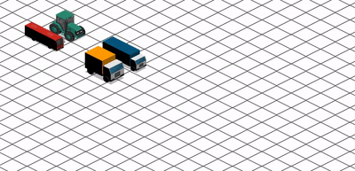

# Animation Station using SAAS

Bring these graphics to life with SAAS!

## Research

[CSS Transform](https://developer.mozilla.org/en-US/docs/Web/CSS/transform)

[Using CSS animations](https://developer.mozilla.org/en-US/docs/Web/CSS/CSS_Animations/Using_CSS_animations)

## Assignments

### Rainy days

Research: [CSS Background position](https://developer.mozilla.org/en-US/docs/Web/CSS/background-position)

1. Using the 'raindrops' background image, set a repeating background for the `<section>` 'rainy-days'.

2. Animate the background to move from top to bottom using CSS3 features `@keyframes` and `animation`.

3. Create a new HTML element inside the `<section>` tag, then using CSS3 set the 'totoro' image to move

from right to left.

Hint: You can animate the property `background-position` to move the background image.

### Retro platformer

1. Set the background colour for the `<section>` tag 'retro-platformer' to something blue.

2. Create an HTML element inside the `<section>` tag, then using CSS3 set the 'bullet-bill' image to move

from right to left.

3. Create a new HTML element inside the `<section>` tag, then set the 'mario' image as background.

4. Animate the mario character to run, jump, land and continue running

### Digital Traffic

Research: [CSS Translate function](https://developer.mozilla.org/en-US/docs/Web/CSS/transform-function/translate)

Research: [CSS z-index](https://developer.mozilla.org/en-US/docs/Web/CSS/z-index)

1. Using the 'isometric' background image, set a repeating background for the `<section>` 'digital-traffic'.

2. Create a new HTML elements inside the `<section>` tag, for each of the following graphics:

- `bus.png`

- `lorry.png`

- `tractor.png`

- `truck.png`

3. Using `position: absolute`, place the elements next to each other, to imitate a road of 2 lanes

4. Animate each vehicle to all move alongside each other at the same speed (so they don't crash!)

and that they follow the isometric lines accurately.

Hint: You will need to move them horizontally and vertically, but you may have to use some trial and error

to determine the correct values.

Hint 2: You only need to animate the `transform` property with the `translate(x, y)` function

Hint 3: Use the `z-index` property to give the illusion that some vehicles are behind or in front

### Space Journey

Research: [CSS Rotate function](https://developer.mozilla.org/en-US/docs/Web/CSS/transform-function/rotate)

1. Using the 'space' background image, set a static background for the `<section>` 'space-journey'.

2. Create a new HTML element inside the `<section>` tag using position absolute, set the 'spaceship' image as

the background.

3. Animate the spaceship position:

- from the top left of the screen to the top right of the screen

- from the top right of the screen to the bottom right of the screen

- from the bottom right of the screen to the bottom left of the screen

- from the bottom left of the screen to the top left of the screen

- ensure the animation performs in one continuous loop

4. Using the property `transform` with the `rotate()` function, animate the spaceship rotation to coincide

with it's position on the screen

### Good luck!

_Rainy days preview_

_Digital traffic preview_
